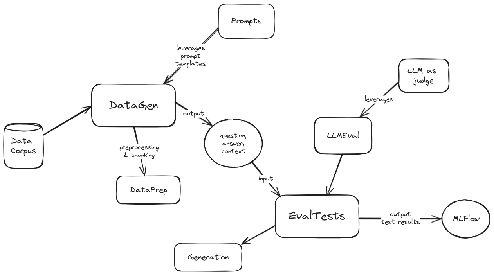

# qEvals

## Table of Contents
- [What is evals?](#what-is-evals)
- [Getting Started](#getting-started)
- [Prerequisites](#prerequisites)
- [Compatibility](#compatibility)
- [Running Tests](#running-tests)
- [Contributing](#contributing)
- [Release Notes](./docs/release_notes/)

<br/>

## What is evals? <a name="what-is-evals"></a>

Evals is a synthetic data generation and evaluation framework for LLMs and RAG applications.

It has 2 main modules:
- datagen
- eval

A high level architecture diagram of evals is the following:

Architecture diagram

<span style="text-align: center; width: 100%;">
    
</span>

## Getting Started <a name="getting-started"></a>

To get started with evals, follow these steps:

1. Clone the repository to your local machine.
2. Install the necessary dependencies by running `pip install -r requirements.txt` in the project directory.
3. Create a copy of `config/config.toml.template` and name it `config/config.toml`.
4. Update 2 sections in the `config.toml` file:
    1. `MISC`
        - Configure your SSL cert file location.
    2. `DATAGEN`
        - Set `DATA_DIR` variable controls the location of the data corpus to generate synthetic data from, it’s relative to the `datagen/data/` directory. In other words, add your data directories in there and specify their name in the variable.
        - The `GEN_PROVIDER` variable allows choosing between `azure` or `vertex`.
        - Add in the rest variables desired for generative purposes.
    3. `DATAEVAL`
        - `EVAL_TESTS` offers a list of evaluation tests supported by the framework. The possible options are `AnswerRelevancy`, `Hallucination`, `Faithfulness`, `Bias`, `Toxicity`, `Correctness`, `Coherence`, `PromptInjection`, `PromptBreaking`, `PromptLeakage`.
        - The `EVAL_RPVODER` variable allows choosing between `azure` or `vertex`.
        - Add in the rest of variables required for the model desired to use as judge for evaluations.

To run the synthetic data generation module:
1. Modify/adapt the sample client provided (`datagen/client.py`)
2. Run `python -m datagen.client`
3. The synthetically generated data will be stored in the `datagen/qa_out/` directory as a CSV file with the format:

        ```csv
        question,context,ground_truth
        ```
To run the eval module:
1. Modify/adapt the sample client provided (`eval/client.py`)
    1. The input data needs to match the format of the data produced by the synthetic data generation (`question`,`context`,`ground_truth`).
    2. The `ground_truth` may or may not be used depending on the setting `use_answers_from_dataset`. When set to `False` it will ignore that data column and generate new outputs using the configured generative model.
2. Start MlFlow by running:
    ```shell
    mlflow ui --port 5000
    ```
3. Run `python -m eval.client`
4. Monitor and analyse the eval results on your local MlFlow interface here: [http://localhost:5000](http://localhost:5000)
